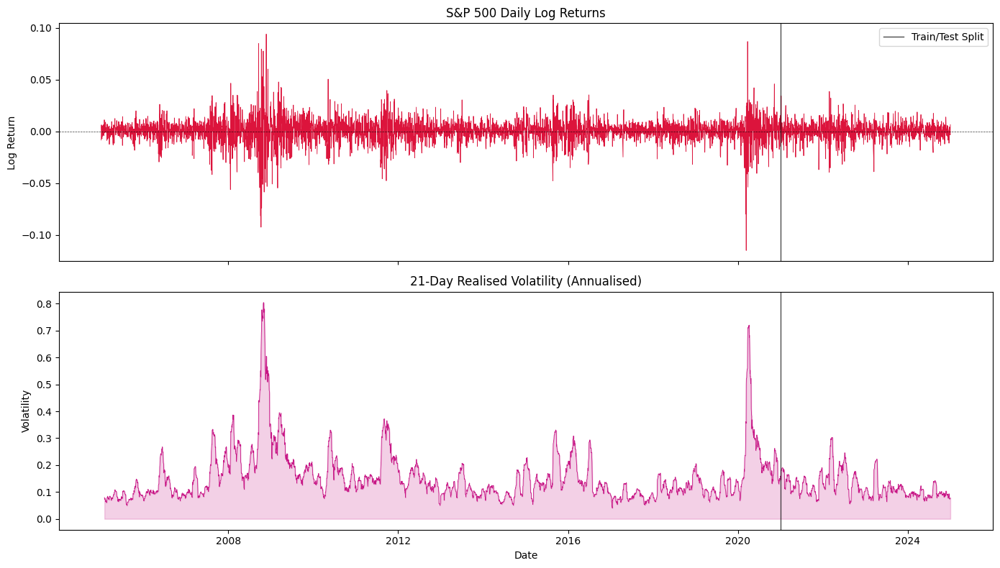
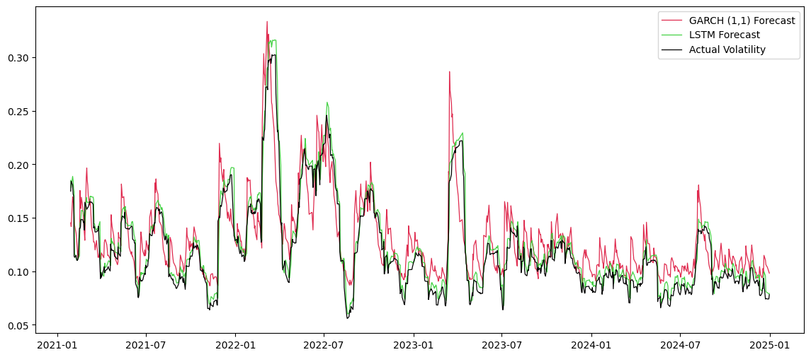

# LSTM-vs-GARCH
## Overview
Exploring how the introduction of AI models in place of GARCH(1,1) can enhance predictive methods - applied to the volatility of FTSE 100 equities. 
## Why Volatility, Not Just Price?
A natural question one might bring up is why not just predict the change in price rather than forecast volatility at all?

An issue that arises with this more simplistic approach is that models aren't perfect, and making large investments is risky. You'd be much more likely to make an investment with an expected return of 10% and 2% variance rather than 25% and 50%, respectively. Yes, more money can be made, but, more importantly, more money can be lost - and there's a higher chance of that. Using volatility allows us to measure this uncertainty in a way that can be weighed against our predicted returns to make a properly risk-adjusted decision.
### Computing Volatility
There are two types of Volatility, **Realised** and **Implied**.

**REALISED**: A measure of how much an asset's price has actually moved over a historical period, calculated from windows of observed data. It is computed by calculating the log returns of each day, i.e. $\ln(P_t/P_{t-1})$ where $P_t$ is the closing asset price on the $\text{t}^{\text{th}}$ day. Then taking the standard deviation of the log returns over a rolling window (I have used a 21 day window - roughly one trading month) and annualising it by multiplying it by the square root of the number of days (252 for a trading year).

**IMPLIED**: The market's collective expectation of the future volatility of an asset - it is based on the current market values of options on that asset. Since these values are based partially on future beliefs about market movement, we can work backwards to find the level of volatility that the market 'implies'. The VIX is a good example of Implied Volatility based on the S&P 500, it spans the next 30 days. There is no explicit formula for this type of volatility, so it can only be calculated numerically starting with the **Black-Scholes formula** - this cannot be rearranged and so our results must be computed iteratively. 

You can think of Realised Volatility as backward-looking and Implied Volatility as forward-looking.

This project uses Realised Volatility rather than Implied since options data has limited access in python and it is harder to forecast directly.

## Models
### GARCH
GARCH (Generalised AutoRegressive Conditional Heteroskedasticity) models compute variance using $\sigma^2_t=\omega + \alpha \times \varepsilon^2_{t-1}+\beta \times \sigma^2_{t-1}$ where $\sigma^2_t$ is the variance on the $\text{t}^{\text{th}}$ day.

- $\boldsymbol{\omega}$ is a baseline constant. It represents the long-run return variance that the model reverts back to when nothing unusual is happening.
- $\alpha \times \varepsilon^2_{t-1}$ is yesterday's 'surprise'. $\varepsilon^2_t$ is yesterday's actual return minus what was predicted, the square amplifies larger moves and keeps it positive. $\alpha$ controls how much weight is given to this 'surprise'.
- $\beta \times \sigma^2_{t-1}$ is yesterday's variance. $\beta$ controls how much weight is given to this variance.

We can interpret the coefficients by adding them together: $\alpha + \beta < 1$ implies a stable model, any dramatic changes will eventually be forgotten; $\alpha + \beta = 1$ implies a model with infinite memory, every fluctuation in the data will be remembered at any point down the line, we call this an IGARCH model; $\alpha + \beta > 1$ implies an unstable model, any shock will blow up over time, rendering the model unrealistic and futile. These coefficients are found using Maximum Likelihood Estimation based on our past data. 

**Why it's the industry standard**
- The $\beta$ term allows high volatility periods to exist which matches real market data perfectly - we are capturing volatility clustering.
- The three parameters are computed quickly and offer direct economic interpretability.
- It works well during calmer market periods.

**Why it can struggle**
- It only looks back one day, so any pattern that is developed over multiple days is invisible to the GARCH, because it doesn't exist in those two numbers.
- The weights are fixed, they don't change based on new market conditions, even when there are huge shocks to the system.
- Since datapoints are squared in the GARCH model, it ignores the direction of change. In reality, markets tend to become more volatile after drops than rises, GARCH models are unable to capture this.
- The nature of GARCH models means that every return, even random noise, is considered into the next forecast, resulting in jagged fluctuations, which can be seen below.

### LSTM model
A main issue with the standard Recurrent Neural Network is the vanishing gradient. They carry hidden states forward during each pass, giving them a form of memory, however since they cannot differentiate between important and irrelevant information, major shocks and sequences are eventually forgotten and ignored. The LSTM (Long-Short-Term Memory) model was made specifically to combat this issue. 

**How it differs from a standard RNN**

The LSTM works by introducing a new state as well as the hidden state, which carries important information through each timestep with minimal interference - acting as long-term memory. Three learnable gates control what happens to this memory:
- **Forget Gate** Looks at the input information, the hidden state and decides what to erase from the cell state, it assigns a number to each state value between 0 and 1, 0 means completely remove, 1 means keep.
- **Input Gate** Decides what new information to write into the cell state from the current input.
- **Output Gate** Looks at the updated cell state and decides what to expose as the hidden state for the next timestep.

Each gate consists of a linear transformation followed by a sigmoid activation, their parameters are decided entirely from the training data. 

**Why LSTMs suit volatility forecasting**
Volatility exhibits long-range dependencies, market shocks don't just affect the next couple days, the resultant trends can persist for a few weeks or even months. While GARCH is able to capture this through the decay parameter $\beta$, LSTM is able to do the same but more flexibly. During training, the forget gate learns how long different types of high volatility signals should be retained for. If a single spike historically means nothing, it will automatically be removed.

In addition, the LSTM in this project uses rolling 20 day windows in order to make predictions, meaning firstly, it uses more data than GARCH to forecast, and secondly, each day appears in around 20 different windows - in different positions each time. This means that the model learns about each volatility level from multiple sequential contexts rather than in isolation. 

## The Data

Data was sourced from yfinance for FTSE 100 (2010-2025) - allowing my model to capture important market regimes including the 2008 financial crisis. Prices weren't used directly, instead realised volatility was calculated using the formula described above. Log returns are better than raw prices as they are stationary and additive rather than exponential, this is important for both LSTM and GARCH models. The train/test split was directly applied to the realised volatility, the training section ended in 2019, making the 2020 COVID-19 crash a genuine out-of-sample stress test. A visualisation of the data is shown below:



The data aligns well with the history of the financial markets, fluctuating consistently, and spiking - a reflection of real world crises, such as the Covid-19 crisis in 2020 and the 2008 financial crisis, times of high volatility.

## Results

After implementing both models, results transparently suggest that the LSTM outperformed the GARCH(1,1) model, it was better in both evaluation metrics - RMSE and MAE. The results are as follows:

| Evaluation Metric | GARCH(1,1) | LSTM |
|-------------------|------------|------|
| RMSE | 0.0239 | 0.0107 |
| MAE | 0.0192 | 0.0074 |

For this data, the RMSE has a 55.2% reduction, and the MAE has a 61.5% reduction - clear evidence of an improvement. The chart below displays the forecasts made by both the LSTM and the GARCH(1,1), against the previously calculated realised volatility. It is immediately evident that the LSTM offers a better performance. 



The line for the GARCH forecast is consistently well above the realised volatility, it also expresses excessive fluctuation suggesting the model is overly reactive to recent return shocks. Despite this, it still brings a well representative forecast of the real data, following its pattern relatively confidently. In contrast, the LSTM forecast remains within close bounds of realised volatility throughout the test period. While not exact, the deviation is substantially smaller than that of the GARCH model.

## Limitations

- **Single Index** The LSTM was only tested on data from the FTSE 100, this makes it tough to assess how to model would perform on more generalised markets. Performing tests against multiple indices would reveal further constraints in our model, for example overfitting.
- **Realised vs Implied Volatility** My LSTM uses realised volatility which is backward-looking. In practice traders are more prone to using implied volatility, which looks forward into the market's future behaviour.
- **Hyperparameter Tuning** The LSTM parameters (number of layers, hidden size etc.) weren't exhaustively altered - a more systematic approach might improve performance.
- **Volatility Regime Changes** The model is trained on a fixed historical period, it may not react well to shifts in market behaviour - such as a prolonged low volatility period, or a crisis unlike those seen in the training data.

## How to Run
Clone the repository and install dependencies:

```bash
git clone https://github.com/h-cossins/lstm-vs-garch.git
cd lstm-vs-garch
pip install -r requirements.txt
```

Then open the notebook, My_Own_LSTM.ipynb in Colab or Jupyter and run cells sequentially. A GPU runtime is recommended in Colab.
